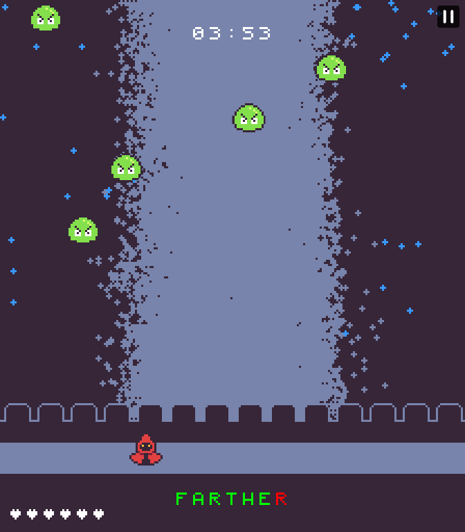
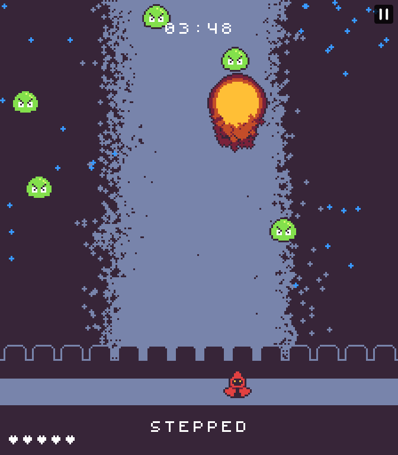

# The Legend of the Typing Mage

> Type words the cast spells against the slime army

This game my first gamefor Trijam. Time spent: 03:41:11. This game was made with KaboomJS.

## Instructions

Type the words on the bottom of the screen to cast your spells. You must defend your castle from the slime army attacking it. The amount of slimes increase with time.

Controls:

- Arrows: Move
- Any Letter: Start attacking
- Backspace: Cancel attack
- "=" key: Pause

Also can move with "," and "." keys.

## Screenshots

